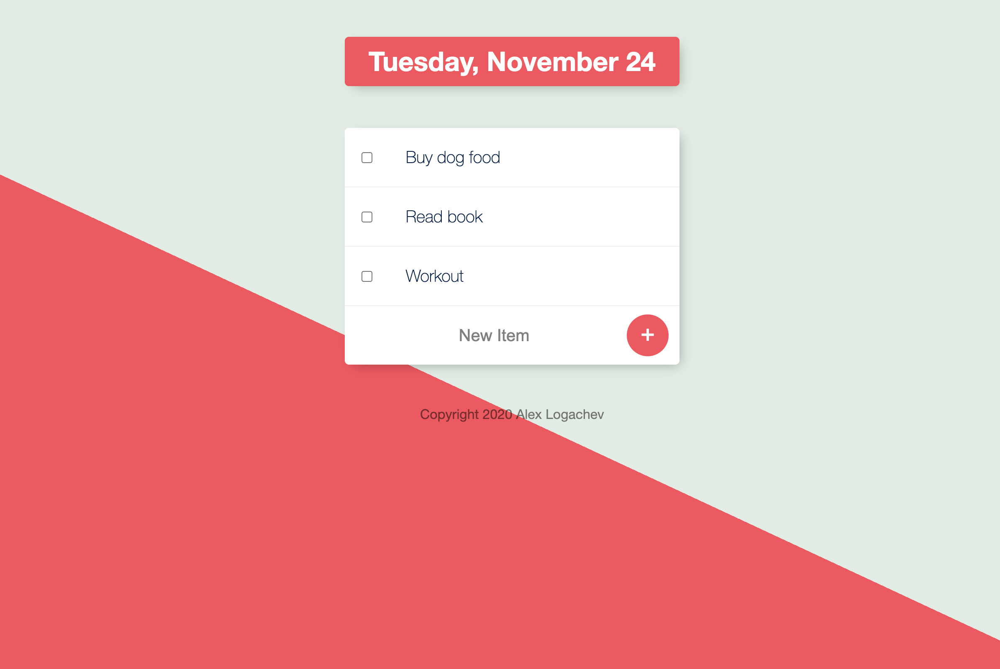

# Project Name
> A simple ToDoList made with EJS and node.js

## Table of contents
* [General info](#general-info)
* [Screenshots](#screenshots)
* [Technologies](#technologies)
* [Setup](#setup)
* [Features](#features)
* [Status](#status)
* [Inspiration](#inspiration)
* [Contact](#contact)

## General info
The goal was to practice EJS, node.js and learn more about basic templating, partials etc.

## Screenshots


## Technologies
* EJS
* node.js

## Setup
```
$ cd ../ToDoList-main
$ npm install
$ npm start
```

## Code Examples
Show examples of usage:
`put-your-code-here`

## Features
List of features ready and TODOs for future development
* Awesome feature 1
* Awesome feature 2
* Awesome feature 3

To-do list:
* Wow improvement to be done 1
* Wow improvement to be done 2

## Status
Project is: _in progress_, _finished_, _no longer continue_ and why?

## Inspiration
Add here credits. Project inspired by..., based on...

## Contact
Created by - feel free to contact me!
